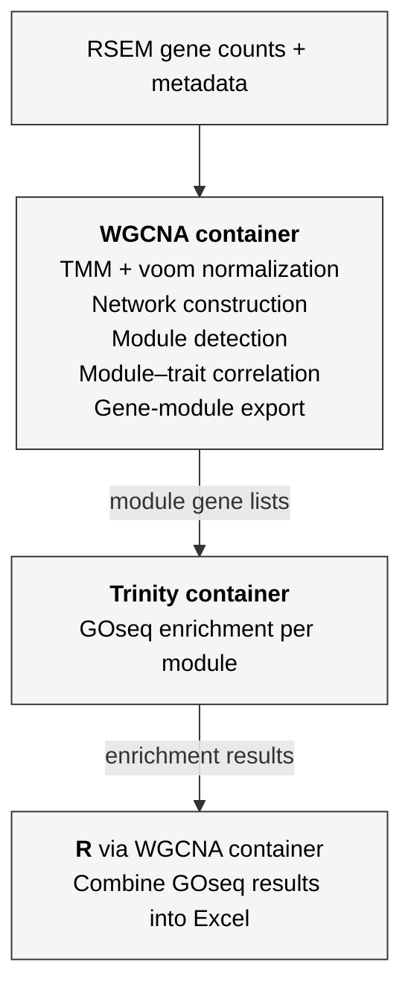

# WGCNA–GOseq Containerized Pipeline

Dockerfile and analysis scripts for running Weighted Gene Co-expression Network Analysis (WGCNA) with GO enrichment in a containerized environment. Built for use on HPC clusters via Apptainer/Singularity.

## Overview

This folder contains a complete WGCNA-to-GO-enrichment pipeline that chains two containers:

1. **WGCNA container** (custom-built) — voom normalization, signed hybrid network construction, blockwise module detection, module–trait correlation, and gene-module mapping
2. **Trinity container** (pre-built from Docker Hub) — GOseq enrichment analysis per module using Trinity's `run_GOseq.pl`

A third step combines all GOseq results into a single Excel workbook using R (run inside the WGCNA container, which doubles as a general R environment). The SLURM job script (`run_wgcna_goseq.sh`) orchestrates all steps, manages input/output directories, and collects results automatically.

## Pipeline steps



## Repository contents

```
wgcna/
├── Dockerfile              Container recipe with all R dependencies
├── WGCNA_CHEMM_v1.R        WGCNA analysis pipeline
├── combine_enrichment.R     Collects GOseq results into a single Excel workbook
├── run_wgcna_goseq.sh       SLURM job script orchestrating the full pipeline
└── README.md
```

## Included packages (WGCNA container)

**Bioconductor:** WGCNA, DESeq2, edgeR, limma

**CRAN:** dplyr, tibble, tidyr, stringr, ggplot2, data.table, glue, readxl, writexl, readr, vegan, RColorBrewer, matrixStats, remotes

**Base image:** [rocker/r-ver:4.3.2](https://hub.docker.com/r/rocker/r-ver) (R 4.3.2)

**Trinity container:** [trinityrnaseq/trinityrnaseq:2.12.0](https://hub.docker.com/r/trinityrnaseq/trinityrnaseq) (pulled from Docker Hub, provides `run_GOseq.pl`)

## Input files

The scripts read input from a directory specified via the `INPUT_DIR` environment variable. The following files are expected:

| File | Used by | Description |
|---|---|---|
| `RSEM.gene.counts.matrix` | WGCNA | Trinity/RSEM raw gene-level count matrix (tab-delimited) |
| `RSEM.gene.TMM.EXPR.matrix` | WGCNA | TMM-normalized expression matrix (tab-delimited) |
| `Blast_GO_wide_CHEMM.RDS` | WGCNA | SwissProt BLAST annotations with GO terms (R object) |
| `Metadata_wgcna.txt` | WGCNA | Sample metadata with trait variables (tab-delimited, must contain a `Samples` or `Sample` column) |
| `go_annotations_CHEMM_G.txt` | GOseq | GO term assignments for genes (tab-delimited) |
| `CD_HIT_EST_CHEMM_all.gene_lengths.txt` | GOseq | Gene length file for GOseq bias correction (tab-delimited) |

## Build and deploy

### 1. Build WGCNA Docker image locally

```bash
docker build -t wgcna .
```

### 2. Save image as tar archive

```bash
docker save wgcna -o wgcna.tar
```

### 3. Pull Trinity image

```bash
docker pull trinityrnaseq/trinityrnaseq:2.12.0
docker save trinityrnaseq/trinityrnaseq:2.12.0 -o trinity.tar
```

### 4. Transfer to HPC

```bash
scp wgcna.tar trinity.tar username@hpc-cluster:/path/to/containers/
```

### 5. Convert to Apptainer SIF on HPC

```bash
apptainer build wgcna.sif docker-archive://wgcna.tar
apptainer build trinityrnaseq_2.12.sif docker-archive://trinity.tar
```

### 6. Run the full pipeline

Place input files in a `runs/wgcna_input/` directory, then submit:

```bash
sbatch run_wgcna_goseq.sh
```

The script automatically creates a timestamped run directory under `runs/`, executes WGCNA module detection, runs GOseq enrichment per module, combines results into an Excel workbook, and logs all output.

## Outputs

| File | Source | Description |
|---|---|---|
| `gene_module_mapping.txt` | WGCNA | Gene-to-module assignments with functional annotations |
| `modules/<color>_module.txt` | WGCNA | Individual module gene lists |
| `Module_Trait_Correlation_Heatmap_Dust.pdf` | WGCNA | Module–trait relationship heatmap |
| `Module_Trait_Correlations.csv` | WGCNA | Correlation values (modules × traits) |
| `Module_Trait_Pvalues.csv` | WGCNA | P-values for module–trait correlations |
| `MEs.RDS` | WGCNA | Module eigengenes (R object) |
| `norm_data.RDS` | WGCNA | Normalized expression matrix (R object) |
| `module_colors.RDS` | WGCNA | Module color assignments (R object) |
| `voom_halla_sprot.txt` | WGCNA | Voom-normalized data with SwissProt IDs for downstream integration |
| `sft_plot.pdf` | WGCNA | Scale-free topology fit and mean connectivity plots |
| `samples_cluster.pdf` | WGCNA | Sample dendrogram |
| `Enrichment_results/*.GOseq.enriched` | GOseq | Enriched GO terms per module |
| `Enrichment_results/*.GOseq.depleted` | GOseq | Depleted GO terms per module |
| `Combined_GOseq_Enrichment.xlsx` | combine_enrichment.R | All module enrichment results in a single Excel workbook |

## Usage notes

The Dockerfile copies `WGCNA_CHEMM_v1.R` into the container at `/home/ruser/`. To run your own WGCNA script instead, use `apptainer exec` with your script path, the container provides all necessary R packages regardless of which script is run.

The `run_wgcna_goseq.sh` script expects both `.sif` container files to be in the working directory. Adjust paths in the script if containers are stored elsewhere.

## Citation

This repository is part of an ongoing study. If you use or adapt any code from this repository, please cite it. A DOI will be provided upon publication. In the meantime, please reference this repository directly:

> https://github.com/n-bsub/bioinformatics-containers/WGCNA

## License

MIT
